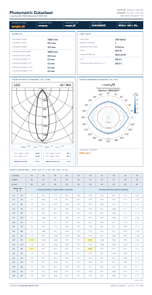

A photometric datasheet consolidates everything an engineer needs from a
luminaire measurement: geometry, lamp data, polar intensity diagram, luminance
polar diagram, and UGR catalogue values — formatted for direct inclusion in a
technical dossier or procurement document.

[`eulumdat-report`](https://pypi.org/project/eulumdat-report/) is a Python
package that generates a complete, print-ready photometric datasheet (HTML and
PDF) from a single EULUMDAT `.ldt` file. It orchestrates the full
`eulumdat-*` ecosystem and renders the report via a Jinja2 HTML template,
converted to PDF by a Playwright Chromium headless browser.

[](sample_02_isym4.html)

> Click the image to open the full interactive HTML report.

---

## Installation

```bash
pip install eulumdat-report
playwright install chromium   # required for PDF output
```

Dependencies: [`eulumdat-py`](https://pypi.org/project/eulumdat-py/),
[`eulumdat-luminance`](https://pypi.org/project/eulumdat-luminance/),
[`eulumdat-ugr`](https://pypi.org/project/eulumdat-ugr/),
numpy, scipy, Jinja2, Playwright.

---

## Quick start

### CLI

```bash
# Generate both HTML and PDF in the same folder as the LDT file
eulumdat-report luminaire.ldt

# Specify an output directory
eulumdat-report luminaire.ldt -o reports/

# HTML only (no PDF, no Playwright required)
eulumdat-report luminaire.ldt --no-pdf

# Include the numerical luminance table
eulumdat-report luminaire.ldt --lum-table
```

### Python API

```python
from eulumdat_report import ReportRenderer
from eulumdat_report.collector import ReportCollector

data = ReportCollector.collect("luminaire.ldt")

html = ReportRenderer.render_html(data)              # → str
ReportRenderer.render_pdf(data, "luminaire.pdf")    # → file
```

---

## Report sections

The generated A4 datasheet contains seven sections:

| Section | Content |
|---------|---------|
| **Header** | Source file name, generation date, package version |
| **Identification** | Luminaire name, manufacturer, catalogue number, date/user, angular grid (ISYM) |
| **Geometry** | Physical dimensions, luminous area dimensions, mounting heights per C-plane |
| **Lamp data** | Lamp count, type, flux (lm), wattage, luminous efficacy (lm/W), LORL, DFF |
| **Polar intensity diagram** | SVG polar diagram (all measured C-planes, from `eulumdat-plot`) |
| **Polar luminance diagram** | SVG polar luminance diagram with peak luminance in cd/m² (from `eulumdat-luminance`) |
| **UGR table** | Full 19-room × 2-direction × 5-reflectance catalogue (from `eulumdat-ugr`) |

An optional **numerical luminance table** (5 elevation angles × 24 C-planes, in cd/m²)
can be appended with `--lum-table`.

---

## UGR catalogue table

The UGR section follows the CIE 117 / CIE 190:2010 tabular method and covers
all 19 standard room configurations, two observation directions (crosswise and
endwise), and five reflectance combinations:

| Reflectances (ceiling/wall/floor) | Typical application |
|-----------------------------------|---------------------|
| 70/50/20 | Standard office |
| 70/30/20 | Low-reflectance walls |
| 50/50/20 | Intermediate |
| 50/30/20 | Industrial |
| 30/30/20 | Dark environment |

The four standard catalogue values (rooms 4H×8H and 8H×4H, SHR = 0.25) are
highlighted in the table. The UGR section is only rendered for luminaires with
a symmetry that allows it (ISYM 1 or 4); for other symmetry codes a warning is
displayed instead.

See [Computing UGR catalogue values from EULUMDAT files with Python](../eulumdat-ugr)
for a detailed description of the underlying methodology.

---

## PNG exports for Word documents

Two helper functions export individual sections as PNG bytes, suitable for
embedding in Word templates via [`docxtpl`](https://pypi.org/project/docxtpl/):

```python
from eulumdat_report import render_ugr_image, render_luminance_image
import io
from docxtpl import DocxTemplate, InlineImage
from docx.shared import Mm

ugr_png  = render_ugr_image("luminaire.ldt")   # → bytes
lum_png  = render_luminance_image("luminaire.ldt")

doc = DocxTemplate("template.docx")
context = {
    "ugr_table": InlineImage(doc, io.BytesIO(ugr_png),  width=Mm(170)),
    "lum_table": InlineImage(doc, io.BytesIO(lum_png),  width=Mm(170)),
}
doc.render(context)
doc.save("output.docx")
```

Both functions also accept a `ReportData` object if the data has already been
collected, avoiding a second read of the LDT file.

---

## Custom templates

The default Jinja2 template (`default.html` + `default.css`) is fully
replaceable via the `--template` CLI option or the `template_path` parameter
of `ReportRenderer`. The template receives a `ReportData` object and a set of
custom Jinja2 filters (`thousands`, `fmt1`, `ugr_fmt`, `lum_fmt`,
`svg_responsive`).

```bash
eulumdat-report luminaire.ldt --template my_template.html -o reports/
```

---

## Ecosystem

`eulumdat-report` is the integration layer of the `eulumdat-*` stack:

```
eulumdat-py          ← LDT parser
  ├── eulumdat-plot       ← SVG polar intensity diagram
  ├── eulumdat-luminance  ← SVG polar luminance diagram + luminance table
  └── eulumdat-ugr        ← UGR catalogue table
          ↑
   eulumdat-report  (orchestrates all of the above)
```

---

## Resources

- [`eulumdat-report` on PyPI](https://pypi.org/project/eulumdat-report/)
- [Source code on GitHub](https://github.com/123VincentB/eulumdat-report)
- [`eulumdat-ugr`](https://pypi.org/project/eulumdat-ugr/) — UGR catalogue values
- [`eulumdat-luminance`](https://pypi.org/project/eulumdat-luminance/) — luminance tables and polar diagrams
- [`eulumdat-plot`](https://pypi.org/project/eulumdat-plot/) — polar intensity diagrams
- [`eulumdat-py`](https://pypi.org/project/eulumdat-py/) — read/write EULUMDAT files
- CIE 117-1995 — Discomfort glare in interior lighting
- CIE 190:2010 — Calculation and presentation of unified glare rating tables for indoor lighting luminaires
