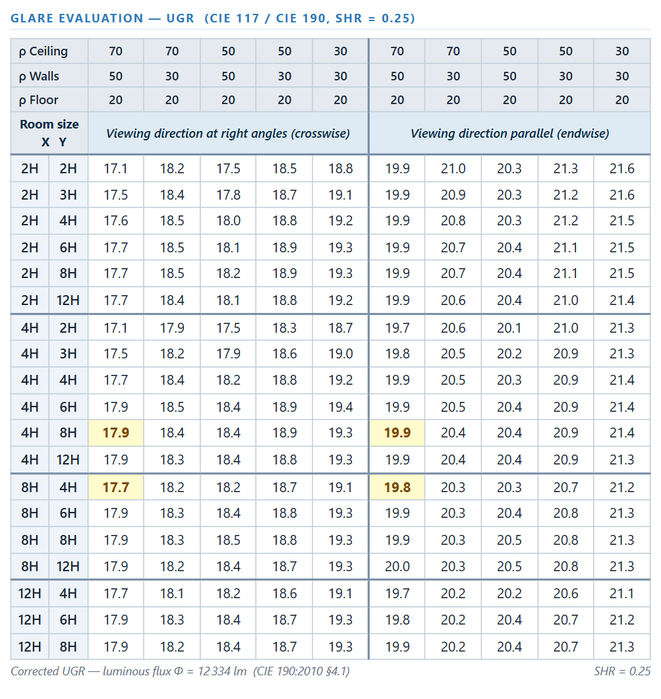

Glare is one of the most critical comfort criteria in lighting design. The
**Unified Glare Rating** (UGR) quantifies the discomfort glare perceived by an
observer in a room uniformly illuminated by identical luminaires. It is defined
by CIE 117-1995 and extended by CIE 190:2010 into a standardised tabular method
that produces **catalogue values** — the four numbers printed on every professional
photometric datasheet.

[`eulumdat-ugr`](https://pypi.org/project/eulumdat-ugr/) is a Python package
that computes the full UGR catalogue table from an EULUMDAT `.ldt` file,
conforming to the CIE 117 / CIE 190 methodology and validated against Relux and
DIALux reference outputs.

> This package depends on [`eulumdat-luminance`](https://pypi.org/project/eulumdat-luminance/)
> for luminance interpolation and projected-area calculation — see
> [Computing luminance tables and polar diagrams from EULUMDAT files with Python](../eulumdat-luminance).

> For a field-by-field description of the EULUMDAT format and ISYM codes,
> see [The EULUMDAT file format — a complete technical reference](../eulumdat-format).

---

## Installation

```bash
pip install eulumdat-ugr
```

Dependencies: [`eulumdat-py`](https://pypi.org/project/eulumdat-py/),
[`eulumdat-luminance`](https://pypi.org/project/eulumdat-luminance/) ≥ 1.2.0,
numpy, scipy.

---

## Quick start

```python
from pyldt import LdtReader
from eulumdat_ugr import UgrCalculator

ldt    = LdtReader.read("luminaire.ldt")
result = UgrCalculator.compute(ldt)

# The 4 standard catalogue values — reflectances 70/50/20
print(result.ugr_4x8_longitudinal["70/50/20"])   # e.g. 18.3
print(result.ugr_4x8_transversal["70/50/20"])
print(result.ugr_8x4_longitudinal["70/50/20"])
print(result.ugr_8x4_transversal["70/50/20"])

# Full table as a list of dicts
for row in result.table():
    print(row)
# {"config": "4Hx8H", "direction": "longitudinal", "refl": "70/50/20", "ugr": 18.3}
# {"config": "4Hx8H", "direction": "transversal",  "refl": "70/50/20", "ugr": 18.1}
# ...

# Export
result.to_csv("ugr.csv")
result.to_json("ugr.json", decimals=1, indent=2)
```

---

## The UGR formula

The UGR formula (CIE 117, eq. 1) sums the glare contribution of every luminaire
visible to the observer:

$$\text{UGR} = 8 \cdot \log_{10}\!\left(\frac{0.25}{L_b} \cdot \sum_i \frac{L_i^2 \cdot \omega_i}{p_i^2}\right)$$

where:

| Symbol | Quantity |
|--------|----------|
| $L_b$ | Background luminance at the observer's eye (cd/m²) |
| $L_i$ | Apparent luminance of luminaire $i$ as seen from the observer (cd/m²) |
| $\omega_i$ | Solid angle subtended by luminaire $i$ at the observer's eye (sr) |
| $p_i$ | Guth position index — penalises luminaires closer to the line of sight |

Each of the three per-luminaire quantities ($L_i$, $\omega_i$, $p_i$) depends on
the geometry between the observer and luminaire $i$, expressed as C-plane and
$\gamma$-angle in the photometric coordinate system.

### Apparent luminance $L_i$

$L_i$ is obtained by bilinear interpolation of the luminance table at the
$(C_i, \gamma_i)$ direction from the observer to luminaire $i$:

$$L_i = L(C_i, \gamma_i) = \frac{I(C_i, \gamma_i)}{A_\text{proj}(C_i, \gamma_i)}$$

where $I$ is the real luminous flux from the EULUMDAT header, and
$A_\text{proj}$ is the projected luminous area — both provided by
`eulumdat-luminance`.

### Solid angle $\omega_i$

$$\omega_i = \frac{A_\text{proj}(C_i, \gamma_i)}{r_i^2}$$

where $r_i^2 = R_i^2 + T_i^2 + H^2$ is the squared distance from the observer
to luminaire $i$.

### Guth position index $p_i$

$p_i$ is read from **Table 4.1 of CIE 117** by bilinear interpolation on the
ratios $H/R_i$ and $T/R_i$, where $H$ is the luminaire mounting height above the
observer's eye, $R_i$ is the horizontal distance along the line of sight, and
$T_i$ is the perpendicular distance. The index amplifies the UGR contribution of
luminaires near the line of sight ($p \approx 1$) and attenuates those far from
it ($p \gg 1$). Luminaires with $T/R > 3$ or $\gamma > 85°$ are excluded from
the sum entirely.

---

## The catalogue method (CIE 190:2010)

CIE 190:2010 defines a set of **standard conditions** under which the UGR formula
is evaluated to produce comparable catalogue values. The four catalogue entries
correspond to two room proportions observed from two directions:

| Room | Observer looks along | Dimensions |
|------|----------------------|------------|
| 4H × 8H | Longitudinal (long axis) | 8 m × 16 m |
| 4H × 8H | Transversal (short axis) | 8 m × 16 m |
| 8H × 4H | Longitudinal (long axis) | 16 m × 8 m |
| 8H × 4H | Transversal (short axis) | 16 m × 8 m |

where $H = 2.0$ m is the mounting height above the observer's eyes (fixed by
CIE 190 §4.2, corresponding to luminaires at 3.2 m with eyes at 1.2 m from the
floor). The observer stands on the mid-point of the short wall, at floor level.

### Luminaire grid

Luminaires are arranged on a uniform rectangular grid with spacing:

$$S = \text{SHR} \times H = 0.25 \times 2.0 = 0.5 \text{ m}$$

This gives 512 luminaires per room configuration. Positions are symmetric around
the observer's lateral axis, starting at $S/2$ from the observer's wall along
the line of sight.

### Background luminance $L_b$

The background luminance at the observer's eye is computed as (CIE 190, eq. 7):

$$L_b = \frac{E_\text{WID}}{\pi}, \qquad E_\text{WID} = B \cdot F_\text{UWID}$$

$B$ is the average wall irradiance from direct flux:

$$B = \frac{\Phi_\text{real} \cdot N}{A_w}$$

where $\Phi_\text{real}$ is the real luminous flux of the luminaire (first lamp
set), $N$ is the number of luminaires, and $A_w = 2H(X+Y)$ is the wall area
between the reference plane and the luminaire plane.

$F_\text{UWID}$ (CIE 190, eq. 8b) combines the downward flux distribution factors
$F_\text{DF}$, $F_\text{DW}$, $F_\text{DC}$ — derived from the luminaire's zonal
flux — with room transfer factors $F_T$ that depend on room size and wall
reflectances. The full table (5 reflectance combinations, 19 room sizes) is
encoded from CIE 190 Tables 4 and 5.

### Full output table

Beyond the four standard catalogue entries, the package computes UGR for all
**19 room sizes** defined in CIE 190 Table 3, covering room indices from $k = 0.6$
to $k = 5.0$. For each room, two observation directions and five reflectance
combinations are evaluated:

| Reflectances (ceiling/wall/floor) | Common application |
|-----------------------------------|--------------------|
| 70/50/20 | Standard office |
| 70/30/20 | Low-reflectance walls |
| 50/50/20 | Intermediate |
| 50/30/20 | Industrial |
| 30/30/20 | Dark environment |

The result is a $19 \times 10$ table (19 rooms × 2 directions × 5 reflectances =
190 UGR values), exportable as CSV or JSON.



---

## Export

```python
# CSV — 19 rows × 10 columns, comma-separated
result.to_csv("ugr_table.csv")

# JSON — structured with reflectance_configs, room_index, and values keys
result.to_json("ugr_table.json", decimals=1, indent=2)
```

The JSON output has three keys:

```json
{
  "reflectance_configs": ["70/50/20", "70/30/20", ...],
  "room_index": [...],
  "values": [[18.3, 18.1, ...], ...]
}
```

---

## Validation

The package was validated against **Relux** and **DIALux** on 11 representative
LDT samples covering a range of luminaire types, sizes, and symmetry modes.

| Reference | Max deviation | Tolerance | Samples |
|-----------|--------------|-----------|---------|
| Relux     | 0.43 UGR     | 0.5 UGR   | 11      |
| DIALux    | 1.01 UGR     | 1.1 UGR   | 11      |

The wider DIALux tolerance reflects a **systematic inter-software bias**: Relux
and DIALux diverge by up to 0.8 UGR for small rooms ($k \leq 1.5$) and low
reflectances (30/30/20). This bias is specific to DIALux and is not present in
the CIE 190 standard. The implementation follows CIE 190:2010 and aligns with
Relux (≤ 0.5 UGR); the DIALux tolerance of 1.1 = 0.8 (inter-software bias) + 0.5
(our residual vs. Relux) accounts for this.

The core algorithm was additionally verified against the worked example in CIE 190
(Table 8 and pages 20–22), confirming the zonal flux factors
($F_\text{DF}$, $F_\text{DW}$) and background luminance to within 0.2%.

---

## Resources

- [`eulumdat-ugr` on PyPI](https://pypi.org/project/eulumdat-ugr/)
- [Source code on GitHub](https://github.com/123VincentB/eulumdat-ugr)
- [`eulumdat-luminance`](https://pypi.org/project/eulumdat-luminance/) — luminance tables and interpolation
- [`eulumdat-py`](https://pypi.org/project/eulumdat-py/) — read/write EULUMDAT files
- CIE 117-1995 — Discomfort glare in interior lighting
- CIE 190:2010 — Calculation and presentation of unified glare rating tables for indoor lighting luminaires
